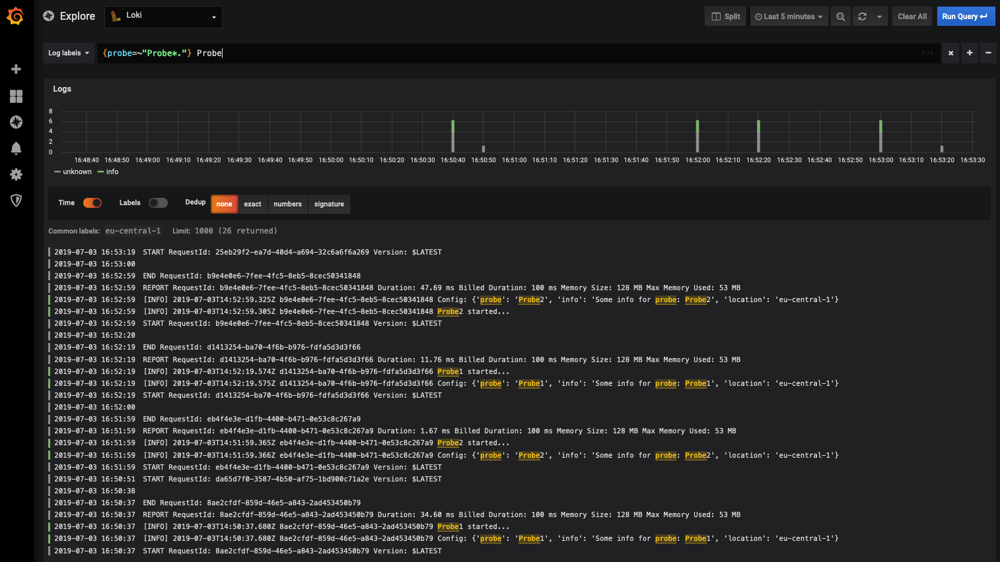

# CloudWatch Loki Logging Example
Simple demo project to demonstrate how CloudWatch logs can be shipped to Grafanas [Loki](https://grafana.com/loki "Loki Homepage") logging backend.  

## Idea
The idea is to create a lambda function which registers a trigger for certain CloudWatch log groups. The function is trigger for all new log entries and forwards
the entries to Loki. To enabled fine grained filter functionalities in Loki, log groups are enriched with AWS tags. The AWS tags are transparently forwarded
to Loki as labels.

## Architecture


## Prerequisites  
- Access to AWS Console and permissions for EC2
- Install virtualenv  [here](https://virtualenv.pypa.io/en/stable/installation/)
- Ensure aws credentials are in place. The CLI utilizes boto3 and thus relies on the credential.
  https://boto3.amazonaws.com/v1/documentation/api/latest/guide/configuration.html
- Ensure the aws cli user has proper rights
    - Lambda full Access
    - IAM read access
    - CloudWatch logs full access
    - CloudWatch events full access
    
### Install
- Clone this repository
- Install Grafana and Loki on a EC2 Host
    - Copy docker-compose file to host, and run it.
    ```bash
    docker-compose up
    ```
    - Configure Loki datasource in Grafana [see here](https://grafana.com/docs/features/datasources/loki/)
    - If deployed with docker-compose, the Loki endpoint is **http://loki:3100**
    - Ensure ports 3000 and 3100 are reachable
    
- Install virtual environment in the local repository
````bash
source setup.rc
````  

- Build python deployment package
````bash
./build-deployment-package.sh
````

## Attach Loki shipper to existing Application Logs

- Start Loki Shipper

    ```bash
    # Start the shipper lambda function
    (venv)$ cd scripts
    (venv)$ python cli.py shipper -l http://<ec2-public-ip>:3100 start
    Created Lambda: loki-log-shipper
    # Attach log subscription for log group
    python cli.py attach --tags "tag1=tag value" -t "tag2=tag2value" <log-group-to-be-shipped-to-loki>
    Created/Updated LogGroup: <log-group-to-be-shipped-to-loki>
    Created log subscription for <log-group-to-be-shipped-to-loki>, on loki-log-shipper
    ```
 
- Stop Loki Shipper

    ```bash
    # Start the shipper lambda function
    (venv)$ cd scripts
    (venv)$ python cli.py shipper stop
    ```

## Full Demo
For demonstration purposes we'll deploy two continuously invoked sample lambdas(**probes**) to produce log entries in CloudWatch. CloudWatch events are used to 
schedule the lambdas. 

In addition a **loki-log-shipper** lambda which subscribes to the **probes** log groups.
In the following it is demonstrated how the demo can be installed and started.

The demo is started with the provided python CLI. 

- Start Demo
    ````bash
    (venv)$ cd scripts
    (venv)$ python cli.py demo -l http://<ec2-public-ip>:3100 start
    Created Lambda: loki-log-shipper
    Created/Updated LogGroup: /aws/lambda/probe-Probe1
    Created Lambda: probe-Probe1
    Created log subscription for /aws/lambda/probe-Probe1, on loki-log-shipper
    Created CloudWatch event: probe-Probe1-trigger
    Created/Updated LogGroup: /aws/lambda/probe-Probe2
    Created Lambda: probe-Probe2
    Created log subscription for /aws/lambda/probe-Probe2, on loki-log-shipper
    Created CloudWatch event: probe-Probe2-trigger
    Demo start
    ````
- Stop Demo
    ````bash
    (venv)$ cd scripts
    (venv)$ python cli.py demo stop
    Demo stop
    ````


## Grafana Loki UI
Now visit the Explore tab at http://<ec2-public-ip>:3000 and you should see something similar to:  



 